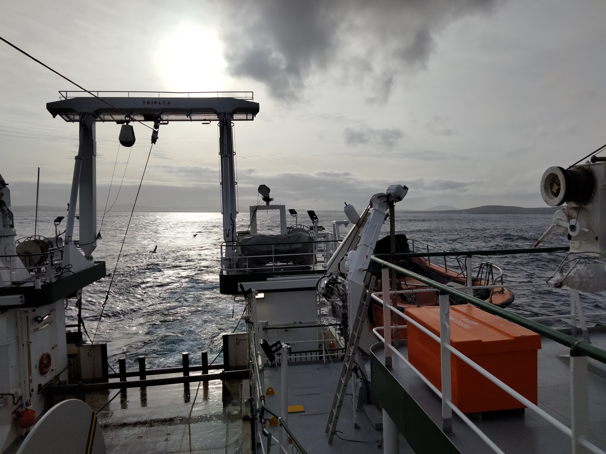
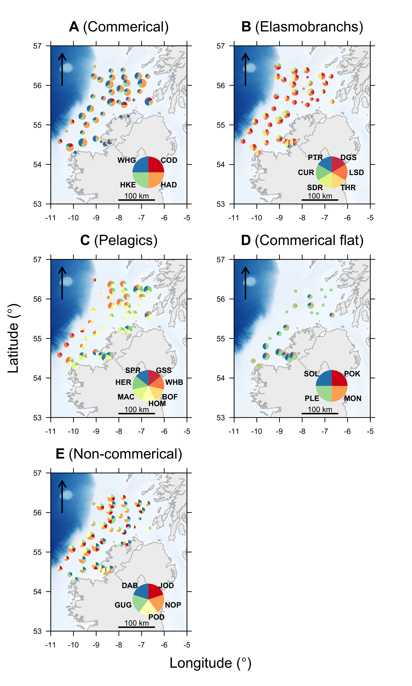

<!-- README.md is generated from README.Rmd. Please edit that file -->

```{r, include = FALSE}
knitr::opts_chunk$set(
  collapse = TRUE,
  comment = "#>"
)
```

^1^ Scottish Oceans Institute, University of St Andrews, Scotland  
^2^ Centre for Research into Ecological and Environmental Modelling, University of St Andrews, Scotland

^\*^ This repository is maintained by Edward Lavender (el72@st-andrews.ac.uk).

[](https://www.repostatus.org/#inactive)

# Introduction

The International Bottom Trawl Survey (IBTS) is an international survey that collects bottom trawl data in the North Atlantic to monitor fish stocks and support scientific research. Under the umbrella of the IBTS, multiple institutions conduct surveys. 

The Irish Groundfish Survey (IGFS) is a survey effort coordinated by the Marine Institute (Ireland) that contributes to the IBTS. 

This repository contains analyses of data collected during the first leg of the IGFS in October--November 2021, including: 

1. **Vessel data**, including information on the ship's track;
2. **Environmental data**, including conductivity, temperature and depth (CTD) data from CTD-rosette deployments and sensors attached to the trawl net;
3. **Fish data**, including data on fishing stations, catches (species composition and weights) and biometrics (length--frequency data);

The analyses are written in `R` and organised as an `R Project`. 



_Figure 1. Aboard the Research Vessel Celtic Explorer on the Irish Groundfish Survey (November 2021). Photograph taken by author._

# Structure 

1. `data-raw/` contains raw data for the project: 
    * `vessel/` contains vessel tracking data;
    * `ctd/` contains CTD data; 
    * `fish/` contains data on trawl stations, catches and biometrics in a file named `IGFS2021_SummaryData.xlsx`, sourced from the IGFS database by David Stokes;
    * `spatial/` contains spatial data:
        * `bathy/` contains bathymetry data for an area ({-15.75417°, 45.62500°}, {-15.75417°, 62.30417°}, {4.90000°, 62.30417°}, {4.90000°, 45.62500°}) around the British Isles from [The General Bathymetric Chart of the Oceans](https://www.gebco.net);
        * `coast/` contains administrative boundary data for the Republic of Ireland (`gadm36_IRL_0_sp.rds`) and the United Kingdom (`gadm36_GBR_0_sp.rds`) from the [Global Administrative Areas database](https://www.gadm.org/) (version 3.6);
        * `ICES` contains International Council for the Exploration of the Sea (ICES) statistical area boundaries (`/ICES_areas/ICES_Areas_20160601_cut_dense_3857.shp`) for the North Atlantic from [ICES](https://gis.ices.dk/geonetwork/srv/api/records/c784a0a3-752f-4b50-b02f-f225f6c815eb);

2. `data/` contains processed data (from `process_data_raw.R`).

3. `R/` contains `R` code for data analysis:
    * `define_global_param.R` defines variables/parameters required by multiple scripts;
    * `process_data_raw.R` processes the raw data for use in this project;
    * `analyse_vessel_*.R` scripts analyse vessel data;
    * `analyse_fish_*.R` scripts analyse fishing and fish data:
        * `analyse_fish_stations.R` analyses trawl-location (station) data;
        * `analyse_fish_catches.R` analyses fish catches (i.e., species composition and weights);
        * `analyse_fish_biometrics.R` analyses fish biometrics (i.e., length--frequency data);
        * `analyse_fish_spp.R` analyses catches and biometrics for selected species and groups;
    * `analyse_ctd_casts*.R` analyses CTD data;

4. `fig/` contains figures.

Note that the `data-raw/`, `data/` and `fig/` folders are not provided in the online version of this repository. 



_Figure 2. Example outputs of the `igfs_2021` project showing haul species composition. Each map refers to a selected group of species and shows the relative number of individuals of each species captured at each sampling station. Pie chart size is proportional to the total number of individuals captured at each station. Species codes are given in Stokes et al. (2014)._

## Packages

This repository uses a number of non-default packages, available from [The Comprehensive R Archive Network](https://cran.r-project.org). These can be installed with `install.packages()`. Two packages that are only available on [GitHub](https://github.com/) are also used:

* [`prettyGraphics`](https://github.com/edwardlavender/prettyGraphics). This package is used for plotting. 
* [`utils.add`](https://github.com/edwardlavender/utils.add). The `utils.add::basic_stats()` function is sometimes used as a convenient routine for summarising data. This could be replaced by base `R` functions, such as `summary()`. 

## References

Stokes, D. et al. (2014). Irish Groundfish Survey Cruise Report, Sept. 24th – Dec. 17th, 2014. Marine Institute.
